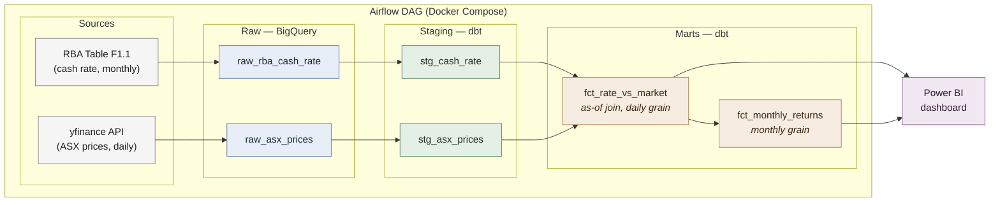

# RBA Cash Rate × ASX Market Performance Pipeline

A batch data pipeline analysing how RBA cash rate changes relate to ASX
market performance (overall and by sector) over 2024–present.

## Question
How do RBA cash rate decisions relate to ASX 200 and sector-level stock
performance over time?

## Architecture



## Data
- **RBA cash rate** (Table F1.1, monthly) — the monetary policy signal
- **ASX prices** (daily, via yfinance): ^AXJO (index), CBA.AX (Financials),
  BHP.AX (Materials), WES.AX (Consumer), CSL.AX (Healthcare)
- Window: 2024-01-01 → present

## Key modeling decision
Daily market data joined to monthly rate data via an **as-of join** — each
trading day is tagged with the prevailing cash rate, preserving daily
granularity while correctly modeling the rate as a step function.

## Stack
Python · Google Cloud Platform · BigQuery · dbt · Airflow · Terraform ·
Docker · Power BI

## Status
🚧 In development

## How to run
## How to run

### Prerequisites

- Docker and Docker Compose
- A Google Cloud project with BigQuery enabled
- A GCP service account with BigQuery Data Editor and BigQuery Job User roles, and its JSON key
- Python 3.11+ (only if running ingestion outside Docker)

### 1. Clone

```bash
git clone https://github.com/nsen2000/rba-asx-data-pipeline-project.git
cd rba-asx-data-pipeline-project
```

### 2. Credentials

Place your service account key at `<PATH WHERE YOUR COMPOSE FILE EXPECTS IT>` — for example `./credentials/gcp-key.json`. This path is gitignored.

Copy the example environment file and fill it in:

```bash
cp .env.example .env
```

| Variable | Description | Example |
|---|---|---|
| `GCP_PROJECT_ID` | Target GCP project | `kestra-sandbox-498004` |
| `BQ_DATASET_RAW` | Dataset for raw landed tables | `raw` |
| `BQ_DATASET_ANALYTICS` | Dataset dbt builds into | `analytics` |
| `BQ_LOCATION` | BigQuery region — must match your dataset | `australia-southeast1` |
| `GOOGLE_APPLICATION_CREDENTIALS` | Path to the key **inside the container** | `/opt/airflow/credentials/gcp-key.json` |

### 3. Start Airflow

```bash
docker compose up -d
```

Airflow's UI comes up at [http://localhost:8080](http://localhost:8080) (default credentials `airflow` / `airflow`). Give the scheduler and webserver a minute to become healthy:

```bash
docker compose ps
```

### 4. Run the pipeline

In the Airflow UI, unpause `<YOUR DAG ID>` and trigger it. Or from the CLI:

```bash
docker compose exec airflow-scheduler airflow dags trigger <YOUR DAG ID>
```

The DAG ingests RBA and ASX data, loads it to BigQuery, then runs `dbt build` over the project.

### 5. Verify

Once the DAG succeeds, the analytics dataset should contain `fct_rate_vs_market` and `fct_monthly_returns`. A quick check:

```sql
select count(*) as rows, max(asx_date) as latest
from `<PROJECT>.<ANALYTICS_DATASET>.fct_rate_vs_market`;
```

To run dbt on its own:

```bash
docker compose exec <DBT SERVICE NAME> dbt build
```

### 6. Dashboard

`dashboard/rba_asx_dashboard.pbix` connects to BigQuery via DirectQuery. Open it in Power BI Desktop and update the data source to point at your own project and dataset.

### Teardown

```bash
docker compose down -v
```

---

## Design decisions and caveats

**As-of join over a monthly aggregate.** The RBA sets the cash rate at discrete announcement dates and it holds constant in between; ASX prices move daily. Rather than averaging prices to monthly and losing detail, each trading day is tagged with the cash rate in force on that day. This keeps daily granularity and models the rate as the step function it actually is.

**Rebased series in the dashboard.** The ASX 200 trades near 8,000 while individual stocks trade between $40 and $180, so plotting raw prices on shared axes makes the smaller series unreadable and the comparison meaningless. All price series are indexed to 100 at the first date in the window, so the charts show relative performance rather than price level.

**The baseline date is arbitrary.** Because every series is rebased to the start of the data window, all relative performance figures are sensitive to where that window begins. A different start date would rank the five tickers differently. The figures should be read as performance *within this window*, not as a general ranking.

**Monthly returns exclude incomplete months.** `fct_monthly_returns` takes each ticker's last *trading* day per month rather than the calendar last day, since the ASX is closed on many month ends. The first month in the series is dropped because it has no prior month to compare against, and the current in-progress month is dropped because a partial month's return is not comparable to a full one.

**Rate changes are expressed in percentage points.** A move from 4.10 to 3.85 is recorded as `-0.25`, not as a percentage change. This matches how rate moves are conventionally discussed and avoids a small absolute cut at a low rate appearing disproportionately large.

**The relationship between rates and returns is weak at this grain.** The dashboard shows the cash rate and market performance together, and over parts of the window they move inversely — but the relationship does not hold consistently, and late in the window the index rises while the rate rises with it. The monthly scatter is included precisely to make that visible rather than implying a causal link from two adjacent lines. This project demonstrates the pipeline, not a trading signal.

**Scope limits.** Five tickers stand in for sector exposure rather than full sector indices. The window begins in 2024, so the pipeline has not been tested against a full rate cycle. Ingestion is batch and idempotent per run; there is no streaming or CDC component.

