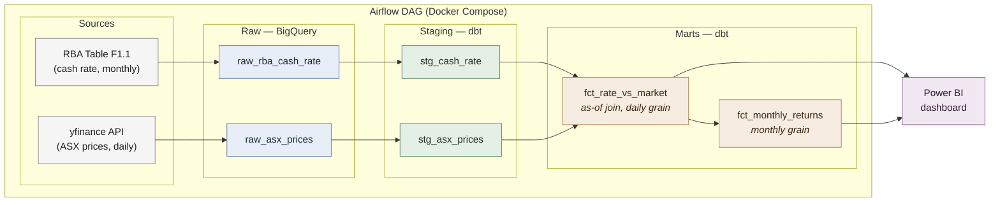

# RBA Cash Rate × ASX Market Performance Pipeline

A batch data pipeline analysing how RBA cash rate changes relate to ASX
market performance (overall and by sector) over 2024–present.

## Question
How do RBA cash rate decisions relate to ASX 200 and sector-level stock
performance over time?

## Architecture

## Data
- **RBA cash rate** (Table F1.1, monthly) — the monetary policy signal
- **ASX prices** (daily, via yfinance): ^AXJO (index), CBA.AX (Financials),
  BHP.AX (Materials), WES.AX (Consumer), CSL.AX (Healthcare)
- Window: 2024-01-01 → present

## Key modeling decision
Daily market data joined to monthly rate data via an **as-of join** — each
trading day is tagged with the prevailing cash rate, preserving daily
granularity while correctly modeling the rate as a step function.

## Stack
Python · Google Cloud Storage · BigQuery · dbt · Airflow · Terraform ·
Docker · Power BI

## Status
🚧 In development

## How to run
_(to be documented)_
=======

