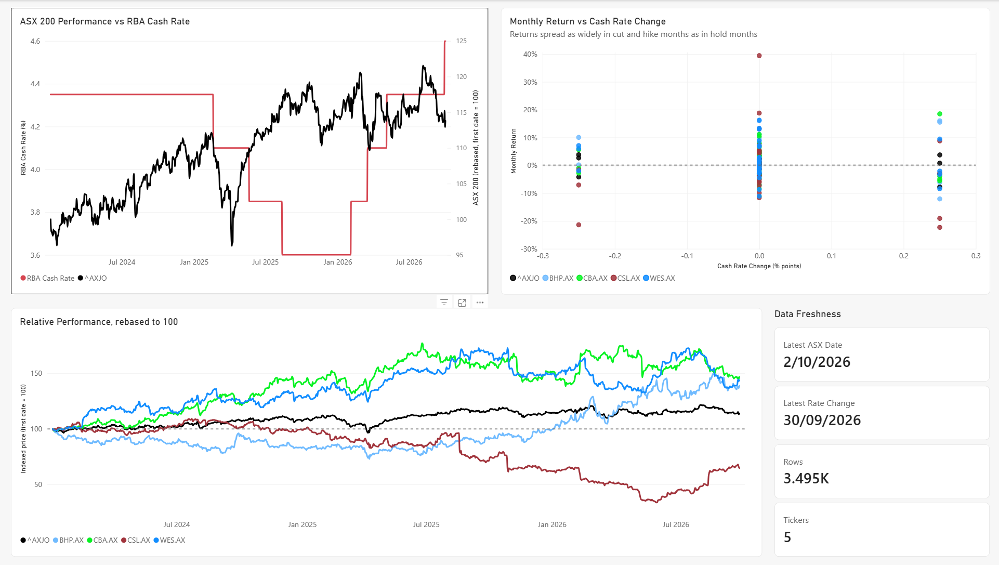
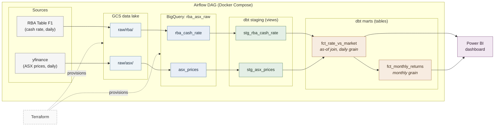

# RBA Cash Rate × ASX Market Performance Pipeline

A batch data pipeline that joins Reserve Bank of Australia cash rate decisions to daily ASX share prices, and asks whether rate moves explain market moves.

Daily, orchestrated end to end: ingestion → Google Cloud Storage → BigQuery → dbt (16 tests) → Power BI. Infrastructure is provisioned with Terraform, orchestration runs in Airflow on Docker Compose, and every project-specific setting comes from a local config file, so it runs in anyone's GCP project.



## Question

How do RBA cash rate decisions relate to ASX 200 and sector-level stock performance over time?

**Short answer:** at monthly grain, not much. Through 2025 the rate and the index look inversely related, but in 2026 the rate rises and the index keeps climbing. Monthly returns spread as widely in cut and hike months as in hold months. See [Findings](#findings).

## Architecture


```mermaid
graph LR
    subgraph Airflow["Airflow DAG (Docker Compose)"]
        direction LR

        subgraph Sources["Sources"]
            RBA["RBA Table F1<br/>(cash rate, daily)"]
            YF["yfinance<br/>(ASX prices, daily)"]
        end

        subgraph Lake["GCS data lake"]
            GCSRBA["raw/rba/"]
            GCSASX["raw/asx/"]
        end

        subgraph Raw["BigQuery: rba_asx_raw"]
            RAWRBA["rba_cash_rate"]
            RAWASX["asx_prices"]
        end

        subgraph Staging["dbt staging (views)"]
            STGRBA["stg_rba_cash_rate"]
            STGASX["stg_asx_prices"]
        end

        subgraph Marts["dbt marts (tables)"]
            FCT["fct_rate_vs_market<br/><i>as-of join, daily grain</i>"]
            MONTHLY["fct_monthly_returns<br/><i>monthly grain</i>"]
        end
    end

    PBI["Power BI<br/>dashboard"]
    TF["Terraform"] -.provisions.-> Lake
    TF -.provisions.-> Raw

    RBA --> GCSRBA --> RAWRBA --> STGRBA --> FCT
    YF --> GCSASX --> RAWASX --> STGASX --> FCT
    FCT --> MONTHLY
    FCT --> PBI
    MONTHLY --> PBI

    classDef source fill:#f5f5f5,stroke:#888,color:#222
    classDef lake fill:#eef4f8,stroke:#6b8fa6,color:#1a2b3c
    classDef raw fill:#e8eef7,stroke:#5b7fa6,color:#1a2b3c
    classDef stg fill:#e4efe6,stroke:#5c8a63,color:#1d2f21
    classDef mart fill:#f7ece1,stroke:#b07d4a,color:#3b2a18
    classDef bi fill:#f2e8f2,stroke:#8a5c8a,color:#2f1d2f
    classDef infra fill:#fafafa,stroke:#999,color:#333,stroke-dasharray: 4 3

    class RBA,YF source
    class GCSRBA,GCSASX lake
    class RAWRBA,RAWASX raw
    class STGRBA,STGASX stg
    class FCT,MONTHLY mart
    class PBI bi
    class TF infra
```

The DAG (`rba_asx_daily_dag`) runs weekdays at 09:00 UTC:

```
[run_asx_ingestion, run_rba_ingestion] >> load_to_bigquery >> run_dbt >> dbt_test
```

The two ingestions are independent, so they run in parallel; everything downstream is sequential. If any task fails, the tasks after it don't run.

## Data

| Source | What | Grain | Window |
|---|---|---|---|
| [RBA Table F1](https://www.rba.gov.au/statistics/tables/) | Cash Rate Target, on the date it applies | Daily | 2020 → present |
| yfinance | ^AXJO (ASX 200 index), CBA.AX (Financials), BHP.AX (Materials), WES.AX (Consumer), CSL.AX (Healthcare) | Daily, one row per ticker | 2024-01-02 → present |

Both sources are re-fetched in full on each run and loaded with `WRITE_TRUNCATE`, so the pipeline is idempotent and picks up any historical revisions.

## Key modelling decision: the as-of join

ASX prices move every trading day. The cash rate changes only on RBA announcement days and holds constant in between. Each trading day needs the rate *in force on that day*.

`fct_rate_vs_market` does this in two stages:

1. **Collapse the daily RBA series into rate periods.** Keep only the days the rate changed (via `LAG`), then give each change an end date: the next change's date (via `LEAD`). About 1,700 daily rows become about 15 periods, each with a `valid_from` and `valid_to`.
2. **Range-join each trading day to the one period it falls inside:** `asx.date >= valid_from AND asx.date < valid_to`. The start is inclusive and the end exclusive, so an announcement day gets the new rate and no day can match two periods.

The result keeps daily granularity, models the rate as the step function it actually is, and has no lookahead: a trading day never sees a rate announced after it. A dedicated test (`assert_no_lookahead_rate`) enforces that.

This design replaced an earlier version that compared every trading day with every RBA row. That was fine with monthly RBA data, but became about 400× more work when the source switched to daily, and BigQuery stopped the query at its compute limit. The rate-period version builds in about two seconds and stays small however much history is added, because rate changes are rare. See [Data-quality story](#data-quality-story).

## Data-quality story

The first version of the monthly scatter plot showed cash rate changes of **0.14** and **0.36** percentage points. The RBA's target only moves in multiples of 0.05, so those values were impossible.

Tracing them back: staging contained values like 0.33, 1.28 and 2.58, and the source CSV's own header described the column as *"Cash Rate Target; monthly average"*. The pipeline had been ingesting RBA Table **F1.1**, where every series is a monthly average; a mid-month rate change averages out to a value the target never actually took. The column mapping was right; the table was wrong.

The fix was switching to Table **F1**, which records the target on the actual date it applies. That surfaced three ways the switch could break silently (a different date format that would have parsed every row as NULL, an extra column shifting every position along by one, and a blank latest row), all handled in `stg_rba_cash_rate`. It also exposed the scaling problem in the original join, which led to the rate-period design above.

## Dashboard

`dashboard/rba_asx_dashboard.pbix` (Power BI Desktop, Import mode). Four visuals:

1. **ASX 200 vs RBA cash rate:** the cash rate as a step line against the index, rebased to 100.
2. **Relative performance:** all five tickers rebased to 100 at the first date, with the index as the benchmark.
3. **Monthly return vs cash rate change:** a scatter from `fct_monthly_returns`, one dot per ticker-month.
4. **Data freshness:** latest trading date, latest rate change, row count, ticker count.

The file stores a data snapshot, so it opens with charts populated and no GCP access needed. To point it at your own data, open Transform data → Data source settings and change the project.

## Findings

- Six RBA decisions fall in the window, all 25 basis points: cuts on 19 Feb, 21 May and 13 Aug 2025; hikes on 4 Feb, 18 Mar and 6 May 2026.
- Through 2025 the rate falls and the index rises; in 2026 the rate rises and the index keeps rising. The inverse relationship doesn't hold across the window.
- Monthly returns in cut and hike months spread as widely, in both directions, as returns in hold months. At this grain, the rate move explains little of what stocks did that month.

The scatter is included precisely to test the relationship, rather than implying one from two lines plotted side by side. This project demonstrates a pipeline, not a trading signal.

## Testing

16 dbt tests, run by the DAG after every build:

- **Grain:** `dbt_utils.unique_combination_of_columns` on `asx_date` + `ticker` (daily fact) and `ticker` + `month_start_date` (monthly fact)
- **Completeness:** `not_null` on keys and the cash rate
- **Validity:** `accepted_values` on ticker, at each layer
- **No lookahead:** singular test `assert_no_lookahead_rate`, which fails if any trading day carries a rate dated after it

## Stack

Python · Google Cloud Storage · BigQuery · dbt · Airflow · Docker Compose · Terraform · Power BI

## Repository layout

```
airflow/          docker-compose.yaml, Dockerfile, .env.example, dags/
ingestion/        ingest_rba.py, ingest_asx.py, load_to_bigquery.py
models/           dbt staging and mart models, sources.yml, schema.yml
tests/            singular dbt tests
terraform/        GCS bucket + BigQuery datasets, terraform.tfvars.example
dashboard/        Power BI file
docs/             dashboard screenshot
dbt_project.yml   dbt project config
profiles.yml      dbt connection (reads the project from the environment)
```

## How to run

### Prerequisites

- Docker and Docker Compose
- Terraform
- The `gcloud` CLI, logged in with `gcloud auth application-default login` (Terraform uses this)
- A Google Cloud project with the BigQuery and Cloud Storage APIs enabled
- A service account in that project with **Storage Object Admin**, **BigQuery User** and **BigQuery Data Editor** roles, and a JSON key for it saved on your machine (outside the repo)

### 1. Clone

```bash
git clone https://github.com/nsen2000/rba-asx-data-pipeline-project.git
cd rba-asx-data-pipeline-project
```

### 2. Provision infrastructure

```bash
cd terraform
cp terraform.tfvars.example terraform.tfvars
```

Edit `terraform.tfvars` with your project ID and a globally unique bucket name, then:

```bash
terraform init
terraform apply
cd ..
```

This creates the GCS bucket and the `rba_asx_raw` and `rba_asx_analytics` BigQuery datasets.

### 3. Configure

```bash
cp airflow/.env.example airflow/.env
```

Fill in `airflow/.env`:

| Variable | What to put |
|---|---|
| `AIRFLOW_UID` | Your user ID: run `id -u` |
| `FERNET_KEY` | Generate with the command in the file's comment |
| `GCP_PROJECT_ID` | Same project as `terraform.tfvars` |
| `GCS_BUCKET` | Same bucket as `terraform.tfvars` |
| `GCP_KEY_PATH` | Full path to your service account JSON key on your machine |

`.env` and `terraform.tfvars` are gitignored; only the `.example` templates are committed.

### 4. Start Airflow

```bash
cd airflow
docker compose up -d --build
docker compose ps
```

The first start builds the image (Airflow plus dbt and yfinance) and takes a few minutes. Wait until the services show `healthy`. The UI is at [http://localhost:8080](http://localhost:8080) (login `airflow` / `airflow`).

### 5. Run the pipeline

The DAG is paused on first load. Unpause and trigger it from the UI, or:

```bash
docker compose exec airflow-scheduler airflow dags unpause rba_asx_daily_dag
docker compose exec airflow-scheduler airflow dags trigger rba_asx_daily_dag
```

A full run takes about a minute.

### 6. Verify

In the BigQuery console:

```sql
select count(*) as row_count, max(asx_date) as latest
from `your-project-id.rba_asx_analytics.fct_rate_vs_market`;
```

Expect a few thousand rows, with `latest` at the most recent trading day.

### Running dbt on its own

Inside the container:

```bash
docker compose exec airflow-scheduler bash -c "cd /opt/airflow/project && dbt build"
```

Or locally, from the repo root, with `dbt-bigquery` 1.12 installed and `gcloud` logged in:

```bash
set -a; source airflow/.env; set +a
dbt deps
dbt build
```

The `set -a` line loads the variables from `.env` into your shell. dbt reads `GCP_PROJECT_ID` from the environment and stops with a clear error if it's missing.

### Teardown

```bash
cd airflow
docker compose down -v      # stops Airflow; -v also deletes its run history
cd ../terraform
terraform destroy           # removes the bucket and datasets
```

## Design decisions and caveats

**Raw and analytics kept separate.** `rba_asx_raw` is an untouched record of what the sources returned; all cleaning happens in dbt. If transformation logic turns out to be wrong, rebuild from raw rather than re-fetching, since sources revise history.

**Full refresh, not incremental.** The data is small and both sources return complete history cheaply, so each run replaces the tables. At scale this would move to incremental loads keyed on a date watermark.

**Config out of code.** Project, bucket and key path are read from environment variables (`airflow/.env`) and Terraform variables (`terraform.tfvars`). Missing values fail immediately with a clear error rather than later with a confusing one.

**Rebased series in the dashboard.** The ASX 200 trades near 8,000 while the individual stocks trade between $40 and $180. Every price series is indexed to 100 at the first date, so the charts compare relative performance rather than price level.

**The baseline date is arbitrary.** Because everything is rebased to the start of the window, relative performance depends on where the window begins; a different start date would rank the tickers differently. Read the figures as performance *within this window*.

**Monthly returns use complete months only.** `fct_monthly_returns` takes each ticker's last *trading* day per month (the ASX is closed on many calendar month-ends). Each ticker's first month is dropped (no prior month to compare against), as is the current in-progress month.

**Rate changes are in percentage points.** A move from 4.10 to 3.85 is recorded as −0.25, not as a percentage change. This matches how rate moves are discussed, and stops a small cut at a low rate looking disproportionately large.

**Scope limits.** Five tickers stand in for sectors rather than full sector indices. The window starts in 2024, so the pipeline hasn't seen a full rate cycle. yfinance is an unofficial library with no service guarantee; a production system would use a paid data provider. Ingestion is batch only, with no streaming.
